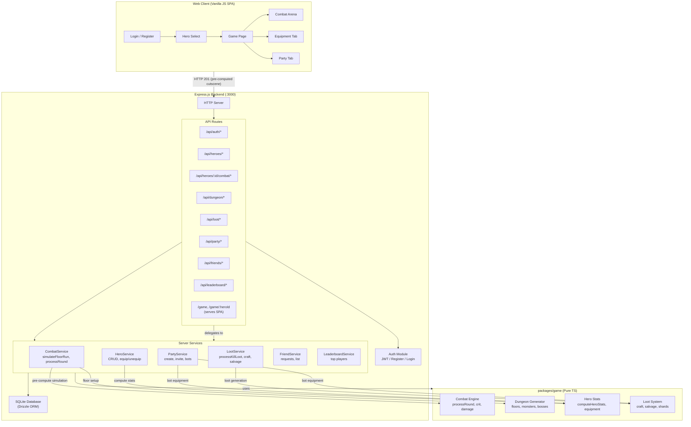

# Jake Idler — Architecture

## Overview

A monorepo idle RPG with an Express.js backend (`apps/server`) and a pure TypeScript game logic library (`packages/game`). The game is a turn-based dungeon crawler where heroes form parties, fight monsters in auto-battling combat, collect loot, and progress through floors.

- **Language:** TypeScript
- **Backend:** Express.js + SQLite (Drizzle ORM)
- **Frontend:** Vanilla HTML/CSS/JS (single-page served by Express)
- **Build:** Turborepo + tsc
- **Database:** SQLite via better-sqlite3

## Directory Structure

```
apps/server/src/
├── auth/          # JWT token generation, verification, middleware
├── config/        # Server configuration
├── db/            # Database connection, schema, migrations
├── routes/        # REST API route handlers (10 files)
├── scripts/       # Utility scripts
├── services/      # Business logic services
├── socket/        # Legacy stub — only exports in-memory Maps
├── store/         # Data access stores
└── index.ts       # Server entry point

packages/game/src/
├── combat-engine.ts   # Core combat mechanics
├── dungeon.ts         # Floor/monster generation
├── hero-stats.ts      # Hero stat computation, equipment stats
├── loot.ts            # Loot generation, crafting
├── types/             # Shared type definitions
└── index.ts           # Package exports
```

## Functional Areas

| Area | Files | Responsibility |
|------|-------|----------------|
| **Auth** | `auth.ts`, `jwt.ts`, `middleware.ts` | Player registration, login, JWT (7-day expiry), route guards |
| **Heroes** | `heroes.ts`, `hero-service.ts` | CRUD + delete, ownership verification, equipment equip/unequip |
| **Combat** | `combat.ts`, `combat-service.ts` | Floor run lifecycle, pre-compute simulation, damage/block/heal |
| **Party** | `party.ts`, `party-service.ts` | Party CRUD, invite/join/leave, bot generation, role assignments |
| **Dungeons** | `dungeon.ts`, `dungeon.ts` (game pkg) | Floor generation, monster queue, bracket bosses |
| **Loot & Crafting** | `loot.ts`, `loot-service.ts`, `loot.ts` (game pkg) | Equipment generation, shard drops, crafting, salvage |
| **Friends** | `friends.ts`, `friend-service.ts` | Friend requests, friend list, pending requests |
| **Leaderboard** | `leaderboard.ts`, `leaderboard-service.ts` | Top players, leaderboard updates |
| **Web Client** | `apps/client/` | Vanilla HTML/CSS/JS SPA: login/register, hero select, dungeon combat, equipment, party |
| **Socket** | `socket/index.ts` | Legacy stub — contains only `onlinePlayers` + `partyMembers` Maps |
| **Game Engine** | `combat-engine.ts` (game pkg) | processCombat, processRound, calculateCrit, calculateDamage, generateMonster |

## Key Execution Flows

### 1. Server Startup
```
index.ts::main()
  → initDatabase()       [db/connection.ts]
  → applyConfigOverrides(balancing.json)
  → HTTP server on :3000
```

### 2. Pre-Compute Combat (Core Gameplay)
Combat is **instantly simulated server-side** in `<50ms`. All rounds are computed in a single synchronous pass, serialized to `roundStates[]`, and returned as a single HTTP 201 response. There is no tick loop, no WebSocket, no per-round fan-out. The client plays the pre-computed result back as a cutscene.

```
POST /api/heroes/:id/combat/start
  → CombatService.simulateFloorRun()  [combat-service.ts:162]
    → for each round:
      → processRound()               [combat-engine.ts:74]
        → healers heal priority
        → heroes attack current monster
        → monsters swarm tank
        → check deaths
      → combatSerializer.buildEvents() [serializers/combat-serializer.ts]
    → return { roundStates[], victory, gold, shards, ... }
  → HTTP 201 JSON response (one shot, no streaming)
```

### 3. Floor Run (Entering Dungeon)
```
POST /api/heroes/:id/combat/start   [combat.ts:10]
  → verifyOwnership()
  → getPartyByPlayer()
  → syncBotLevels()
  → CombatService.startFloorRun()   [combat-service.ts:137]
    → generateMonsterQueue()        [scale monsters by party size]
    → computeHeroStats()            [per party member]
  → return { heroes, monsters }
```

### 4. Loot Pipeline
```
generateFloorLoot()                 [loot.ts:169]
  → generateEquipment()             [roll rarity, slot, stats]
  → computeEquipmentStats()         [apply stat blocks]
  → getSlotCategory()
processMonsterLoot()                [loot.ts:96]
  → rollShardDrops()
  → getAdjustedDropRate()
```

### 5. Party & Bot System
```
PartyService.addBot()               [party-service.ts]
  → generateBotEquipment()          [create weapon/armour/accessory]
    → makeWeapon()
    → makeArmour()
    → makeAccessory()
PartyService.updateBotLevel()       [regenerate equipment at level]
```

### 6. Web Client Flow
```
GET /game                            → Login/Register screen
  → POST /api/auth/register|login    → JWT token
  → GET /api/heroes                  → Load hero list
  → GET /game/:heroId                → Full game SPA
    → Tabs: Dungeon | Equipment | Party
    → Dungeon: select floor → combat start → cutscene playback (pre-computed)
    → Combat renders: Boss → Trash → Tank → DPS → Healer rows
```

## Mermaid Architecture Diagram



## Data Flow

```
Player → Auth (JWT) → Hero (owns multiple)
  Hero joins Party → Other heroes (player or bot)
  Party enters Dungeon → CombatService.startFloorRun()
    → Generate monsters (scaled by party size)
    → All rounds simulated instantly server-side
    → Monster dies → Loot drop → Hero gains XP/gold
    → Floor complete → Next floor or repeat
```

## Notes

- **No WebSocket** — Combat is pre-computed and returned as a single HTTP 201 response. No per-round streaming, no tick loop, no server-side scheduler.
- **No React/Vue** — Vanilla HTML/CSS/JS served from `apps/client/`
- **Bot heroes** — Auto-generated with equipment when added to a party; synced to the initiating hero's level
- **Role system** — Tank (front, block), DPS (middle, damage), Healer (rear, heal); positions affect targeting
- **Equipment** — 12 slot types across weapon, armour, accessory categories; stats are BigNumber-based
- **Animations** — CSS `@keyframes`-based cutscene playback engine with a central `ANIMATION_CONFIG` in `apps/server/config/balancing.json` and a mirror JS config in `apps/client/index.html`. All timing is configurable without source edits.
